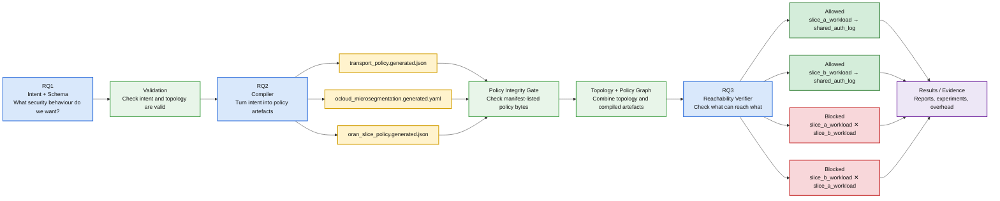
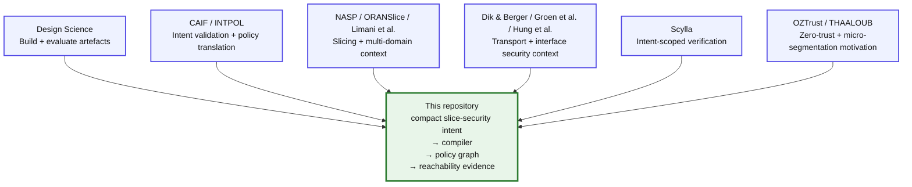

# RQ-to-Repo Mapping and Related-Work Methodology Alignment

This document explains how the GitHub repository maps to the thesis research questions, methodology, and related-work patterns.

The repository is not a separate coding exercise. It is the practical proof-of-concept implementation of the thesis pipeline.

## Main research question

For supervisor discussion, the three research questions can be summarised by the following umbrella question:

> How can a compact, transport-aware slice-security intent be represented, compiled into coordinated policy artefacts, and statically verified to show that forbidden cross-slice reachability is absent while required shared-service reachability remains available?

In simpler terms:

> Can we write a small security intent, turn it into policy files, and then check whether the resulting model blocks the paths that should be blocked while keeping the one required shared service reachable?

The three research questions remain distinct stages of one pipeline:

- **RQ1: Intent representation:** compact slice-security intent and schema validation.
- **RQ2: Policy compilation:** deterministic compiler producing three coordinated representational artefacts.
- **RQ3: Verification:** graph-based reachability checking over the compiled policy-and-topology model.

## What this repository is trying to show

The repository demonstrates one bounded assurance workflow:

```text
slice-security intent
→ validation
→ policy compilation
→ manifest-based policy integrity check
→ graph construction
→ reachability verification
→ evidence reports
```

The focus is deliberately narrow:

- two slices: `slice_a` and `slice_b`
- one shared service: `shared_auth_log`
- three generated policy artefacts
- one static graph-based reachability verifier
- one bounded assurance property: forbidden cross-slice paths should be absent while required shared-service paths remain available

The repository does **not** claim to implement a full production O-RAN deployment or a complete O-RAN/3GPP slice lifecycle.

## Methodology pipeline



**Figure:** Mapping of the thesis research questions to the repository pipeline: RQ1 defines the intent, RQ2 compiles it into three representational artefacts, and RQ3 checks policy-file integrity before verifying the resulting policy-and-topology graph.

## RQ1: compact machine-readable slice-security intent schema

### Plain-English meaning

RQ1 asks whether the required security behaviour can be written in a compact form that a machine can validate.

The intent describes:

- which slices exist
- which shared service is allowed
- which cross-slice paths are forbidden
- whether default deny is enforced
- which minimum transport and O-Cloud controls are required

### Main repo files

- `schemas/slice_security_intent.schema.json`
- `intents/two_slice_shared_auth_log.valid.yaml`
- `intents/invalid/*.yaml`
- `src/oran_slice_security/validation.py`
- `topology/base_topology.yaml`

### Demonstrated by

```bash
make validate
```

or:

```bash
python -m oran_slice_security validate-intent \
  --schema schemas/slice_security_intent.schema.json \
  --intent intents/two_slice_shared_auth_log.valid.yaml

python -m oran_slice_security validate-topology \
  --topology topology/base_topology.yaml
```

Those commands check only the valid baseline intent and topology. Run the full E1 valid and invalid case set with:

```bash
python experiments/run_e1_schema_expressiveness.py
```

The individual E1 command prints JSON to standard output. `python experiments/run_all_experiments.py` retains the E1 result in the combined experiment summary.

### Evidence

- the valid intent is accepted
- invalid intents are rejected
- schema and semantic validation tests pass
- E1 reports schema expressiveness results

Relevant outputs include:

- `results/reports/experiment_summary.json`
- `results/reports/experiment_summary.md`

### What RQ1 proves

RQ1 shows that the bounded slice-security scenario can be represented in a compact, machine-readable form.

### What RQ1 does not prove

RQ1 does not prove that this schema is a full industry O-RAN slice descriptor, a complete 3GPP slice lifecycle model, or a general slice-security language for every possible deployment.

## RQ2: compiler generating coordinated policy artefacts

### Plain-English meaning

RQ2 asks whether one validated intent can be translated into three coordinated policy representations.

The compiler produces exactly three policy artefacts:

- transport segmentation policy
- O-Cloud micro-segmentation policy
- minimal slice-scoped O-RAN policy representation

These are representational and graph-consumable artefacts, not production deployment files.

### Main repo files

- `src/oran_slice_security/compiler.py`
- `src/oran_slice_security/policy_models.py`
- `policies/generated/transport_policy.generated.json`
- `policies/generated/ocloud_microsegmentation.generated.yaml`
- `policies/generated/oran_slice_policy.generated.json`
- `policies/generated/manifest.json`

### Demonstrated by

```bash
make compile
```

or:

```bash
python -m oran_slice_security compile \
  --schema schemas/slice_security_intent.schema.json \
  --intent intents/two_slice_shared_auth_log.valid.yaml \
  --topology topology/base_topology.yaml \
  --out policies/generated
```

Those commands create one generated bundle. Run the E2 coherence and repeated-hash checks with:

```bash
python experiments/run_e2_compiler_coherence.py
```

The individual E2 command writes the generated policy bundle and prints its result to standard output. `python experiments/run_all_experiments.py` retains the E2 result in the combined experiment summary.

### Evidence

RQ2 is shown by:

- exactly three generated policy artefacts
- consistent slice identifiers
- consistent S-NSSAI-style values
- consistent shared-service references
- consistent transport-segment references
- consistent O-Cloud labels
- deterministic output hashes
- conflict rejection
- a manifest that records the expected SHA-256 digest for each of the three generated policy files

Relevant outputs include:

- `policies/generated/transport_policy.generated.json`
- `policies/generated/ocloud_microsegmentation.generated.yaml`
- `policies/generated/oran_slice_policy.generated.json`
- `policies/generated/manifest.json`
- `results/reports/experiment_summary.json`
- `results/reports/experiment_summary.md`
- `results/reports/artifact_integrity.json`
- `results/reports/artifact_integrity.md`

### What RQ2 proves

RQ2 shows that the same validated slice-security intent can be compiled into three coordinated representational policy artefacts.

### What RQ2 does not prove

RQ2 does not prove that the generated artefacts are production-ready Kubernetes policies, live RIC policies, xApp/rApp policies, carrier transport-controller rules, or complete O-RAN deployment artefacts.

## RQ3: static graph-based reachability verification

### Plain-English meaning

RQ3 asks whether the compiled policy-and-topology model actually produces the expected reachability result.

The verifier checks whether:

- both slices can reach the approved shared service
- the two slice workloads cannot reach each other
- the transport slice segments cannot directly reach each other
- `shared_auth_log` cannot act as a bridge between slices

### Main functional and security files

- `src/oran_slice_security/graph_builder.py`
- `src/oran_slice_security/integrity.py`
- `src/oran_slice_security/verifier.py`
- `src/oran_slice_security/report.py`
- `verifier/queries/baseline_queries.yaml`
- `topology/negative_controls/*.yaml`
- `results/reports/verification_report.json`
- `results/reports/verification_report.md`
- `results/reports/artifact_integrity.json`

### Performance and scale characterisation files

- `src/oran_slice_security/scaling.py`
- `results/metrics/overhead_repeated.json`
- `results/metrics/baseline_performance_repeated.json`
- `results/metrics/multislice_verifier_scaling.json`

### Demonstrated by

```bash
make verify
```

or:

```bash
python -m oran_slice_security verify \
  --topology topology/base_topology.yaml \
  --policies policies/generated \
  --queries verifier/queries/baseline_queries.yaml \
  --out results/reports
```

Run the core pipeline, automated tests, and the E1 to E7 experiment pack with:

```bash
make run-all
```

Run only the E1 to E7 experiment pack with:

```bash
python experiments/run_all_experiments.py
```

Repeated E5, E6-P, and S1 are separate performance and scale runs. They are not invoked by either command above.

### Functional and security evidence

RQ3 is shown by:

- `slice_a_workload` can reach `shared_auth_log`
- `slice_b_workload` can reach `shared_auth_log`
- `slice_a_workload` cannot reach `slice_b_workload`
- `slice_b_workload` cannot reach `slice_a_workload`
- `tn_segment_slice_a` cannot reach `tn_segment_slice_b`
- `tn_segment_slice_b` cannot reach `tn_segment_slice_a`
- `shared_auth_log` has no outgoing transit path
- five unsafe E4 topologies are rejected during validation and one over-restrictive topology is rejected during verification
- the proposed condition is compared with permissive topology-only and deny-all controls
- a byte-only change to a manifest-listed generated policy is rejected before graph construction

Relevant functional and security outputs include:

- `results/reports/verification_report.json`
- `results/reports/verification_report.md`
- `results/reports/experiment_summary.json`
- `results/reports/experiment_summary.md`
- `results/reports/baseline_comparison.json`
- `results/reports/baseline_comparison.md`
- `results/reports/artifact_integrity.json`
- `results/reports/artifact_integrity.md`

### Performance and scale characterisation

- E5 reports local pipeline timing and Python allocation for one host and one fixed workload.
- E6-P reports pure verification time for the three E6 graph conditions without changing their functional result.
- S1 measures generated verifier-only graphs representing 2, 3, 4, and 10 slices, with an injected forbidden route detected at every tested size.

Relevant performance and scale outputs include:

- `results/metrics/overhead_metrics.json`
- `results/metrics/overhead_repeated.json`
- `results/metrics/baseline_performance_repeated.json`
- `results/metrics/baseline_performance_repeated.csv`
- `results/reports/baseline_performance_repeated.md`
- `results/metrics/multislice_verifier_scaling.json`
- `results/metrics/multislice_verifier_scaling.csv`
- `results/reports/multislice_verifier_scaling.md`

### What the functional and security evidence shows

RQ3 shows that, in the bounded local policy-and-topology model, the compiled artefacts preserve required shared-service reachability and remove forbidden cross-slice reachability. E6 further shows that the compiled-policy condition is the only tested condition that satisfies both availability and isolation objectives simultaneously: the permissive condition preserves access but exposes forbidden paths, while deny-all blocks forbidden paths but removes required access. E7 shows that a byte change to a manifest-listed policy is rejected before graph construction.

### What the performance and scale evidence characterises

E5 characterises local pipeline cost for one fixed workload. E6-P characterises pure verifier cost for the three E6 graph conditions. S1 characterises verification across four generated graph sizes. These measurements do not provide additional functional or security evidence and do not establish production scalability.

### What RQ3 does not prove

RQ3 does not prove runtime packet delivery, production scalability, runtime drift detection, authenticated manifest integrity, xApp trustworthiness, full O-RAN security, or correctness for arbitrary large networks. S1 bypasses the end-to-end intent schema, semantic validator, compiler, compiled-policy loader, and topology-to-policy graph builder.

## E6: controlled baseline comparison

E6 compares three conditions while holding the source topology, eight-node set, two required queries, four forbidden queries, terminal-service query, and deterministic breadth-first verifier constant:

- **Permissive topology-only:** each non-governance topology adjacency is available bidirectionally. Required shared-service paths remain available, but none of the four forbidden paths is blocked and the shared service can become transit.
- **Deny-all:** all communication edges are removed. Forbidden paths are blocked, but both required shared-service paths are lost.
- **Proposed compiled policy:** the five policy-permitted edges preserve both required paths, block all four forbidden paths, and keep `shared_auth_log` terminal.

The comparison isolates a safety-availability trade-off inside the synthetic model. It does not compare the prototype with production O-RAN products or establish operational superiority. Primary outputs are `results/reports/baseline_comparison.json` and `results/reports/baseline_comparison.md`.

## E6-P: repeated verification performance

The retained E6-P study measures only the deterministic `verify_graph` call. Five warm-up batches precede 30 measured batches for each condition, with 500 verifications in each batch. Median verification time was 0.023750 milliseconds for the 10-edge permissive graph, 0.006054 milliseconds for the zero-edge deny-all graph, and 0.012360 milliseconds for the five-edge compiled-policy graph.

These values characterise execution cost, not functional or security effectiveness. The separate E6 comparison establishes the functional result: the permissive condition fails the forbidden-path and terminal-service criteria, deny-all fails required reachability, and the compiled-policy condition alone satisfies all criteria. Primary E6-P outputs are `results/metrics/baseline_performance_repeated.json`, `results/metrics/baseline_performance_repeated.csv`, and `results/reports/baseline_performance_repeated.md`.

## E7: post-compilation policy integrity

E7 tests the handoff from generated policy files to graph construction. The clean three-policy bundle passes both the manifest check and verification. A whitespace-only byte change to the transport policy leaves its parsed JSON meaning unchanged but changes its SHA-256 digest. The integrity gate rejects that bundle before graph construction and does not write a passing verification report. Clean regeneration restores the original policy hashes and the passing result.

This is a narrow file-consistency check. It does not provide manifest authentication, detection of coordinated policy and manifest tampering, protection against a change after the check, topology, query, or report binding, detection of a compromised compiler or verifier, or runtime drift observation. Primary outputs are `results/reports/artifact_integrity.json` and `results/reports/artifact_integrity.md`.

## S1: bounded verifier-only scale study

S1 generates in-memory graphs representing 2, 3, 4, and 10 slices while leaving the verifier logic fixed. The measured cases range from 8 nodes, 5 edges, 7 criteria, and 8 path searches at 2 slices to 32 nodes, 21 edges, 191 criteria, and 200 path searches at 10 slices. Median verification time rises from 0.0150415 milliseconds to 0.2779585 milliseconds across that range. The condition medians for worker peak process resident memory range from 32.4375 to 32.609375 mebibytes. An injected forbidden route is detected at every tested size.

S1 bypasses the end-to-end intent schema, semantic validator, compiler, compiled-policy loader, and topology-to-policy graph builder. Those components remain bounded to two slices. No capacity breaking point is claimed because no time or memory failure threshold was declared before the run. Primary outputs are `results/metrics/multislice_verifier_scaling.json`, `results/metrics/multislice_verifier_scaling.csv`, and `results/reports/multislice_verifier_scaling.md`.

## Why the slice model is abstracted

The slice model is deliberately simplified because the thesis tests one bounded assurance workflow, not a full industry slice implementation.

In real deployments, slice definitions may be spread across many layers and artefacts, including:

- RAN configuration
- transport configuration
- core-network configuration
- O-Cloud configuration
- orchestration descriptors
- policy files
- runtime monitoring systems

This repository does not try to reproduce all of those layers.

Instead, it uses a compact model that is sufficient to test the thesis claim:

> Can a slice-security intent be represented, compiled, and statically checked for forbidden cross-slice reachability?

This abstraction keeps the work feasible, reproducible, and aligned with the research questions.

## Why graph verification matters

The intent says what should happen.

The compiler generates policy artefacts that are supposed to implement that intent.

The topology describes the modelled environment.

The graph verifier checks the combined result.

This matters because mistakes can happen between the original intent and the compiled model. For example:

- the intent may be valid but the compiler may generate inconsistent artefacts
- the transport policy may allow something the workload policy denies
- the topology may contain an unsafe direct cross-slice edge
- the shared service may accidentally become a transit bridge
- policy and topology may disagree about what is reachable

The graph step is therefore an assurance check over the post-compilation model, not just a restatement of the original intent.

Negative controls are included to show that the verifier is not merely restating the intended configuration; unsafe or inconsistent cases must be rejected.

## Methodology foundation

Hevner et al. and Peffers et al. justify the design-science framing used in this thesis. Their role is not to provide O-RAN evidence, but to justify artefact construction, demonstration, evaluation, and communication as a valid research method.

This is the relevant methodological pattern for the repository: a bounded problem is defined, artefacts are built, those artefacts are demonstrated in a controlled setting, and the resulting behaviour is evaluated against explicit criteria.

## Methodology and related-work alignment

The repository follows a research style used in several related works, while keeping the actual contribution narrower and more bounded.

The common pattern is:

- build a proof-of-concept artefact
- validate or constrain intent before execution
- translate intent into policy or deployment artefacts
- evaluate the result in a controlled model, testbed, or prototype
- report bounded evidence rather than claiming production-wide assurance

The purpose of this comparison is not to argue that any one related work is identical to this thesis. Instead, each work supports one methodological part of the pipeline: intent representation, validation, compilation, multi-domain coordination, zero-trust enforcement, prototype evaluation, or reachability verification. The distinct contribution of this thesis is the bounded integration of these parts around one static cross-slice non-reachability property.

### Related-work alignment chart



### Related work mapped to methodology and evidence

| Related work | Similar methodology or evidence style | What it evaluates | How it supports this thesis | Why this repository remains distinct |
| --- | --- | --- | --- | --- |
| **CAIF** | Intent-based O-RAN slicing pipeline with contract-style validation before actuation | Safer handling of O-RAN slicing intent before downstream execution | Supports the RQ1/RQ2 logic that O-RAN slicing intent benefits from structured validation before execution | This thesis uses structured security intent and static verification, whereas CAIF focuses on agentic/O-RAN slicing intent and contract-guarded actuation |
| **NASP** | Higher-level slice requests translated into coordinated multi-domain deployment artefacts | Network-slice-as-a-service orchestration across domains | Supports RQ2 by showing that slice requests need coordinated multi-domain outputs | NASP is orchestration and deployment focused, whereas this repository is security-assurance focused |
| **INTPOL** | Security intent translated into controller-level policy and checked with bounded formal methods | Intent translation, policy conflict detection, and invariant checking | Strongly supports the intent → policy → verification pattern behind RQ2 and RQ3 | INTPOL is the closest methodological analogue, but it is SDN-focused rather than O-RAN slice-security focused |
| **Scylla** | Intent-specific reachability and segmentation verification rather than one monolithic network model | Data-plane verification using intent-based slices and performance measurements | Supports RQ3 by showing that verification can be scoped around specific intents rather than requiring a full monolithic model | Scylla is a large-scale data-plane verifier, whereas this repository is a bounded local verifier tied to compiled slice-security artefacts |
| **ORANSlice** | Open-source O-RAN slicing platform with practical testbed evaluation | Programmable O-RAN slicing, xApps, E2 service models, and slicing demonstrations | Supports O-RAN slicing as a realistic implementation context | ORANSlice is a slicing platform, whereas this repository abstracts the slice model to verify one security property |
| **Limani et al.** | End-to-end 5G slice isolation proof of concept across RAN, transport, and core | Practical isolation principles across multiple 5G domains | Supports the importance of cross-domain isolation and transport-aware reasoning | Their work engineers isolation in a deployment, whereas this repository compiles security intent and verifies reachability in a small model |
| **Dik & Berger / Groen et al. / Hung et al.** | Interface and transport security analysis using implementation, emulation, or experimental evidence | Fronthaul, E2, xApp/API, encryption, and open-interface security exposure | Supports the transport-aware and open-interface threat context | These works focus on interface protection and exposure, whereas this repository focuses on slice-security intent compilation and cross-slice reachability assurance |
| **OZTrust / THAALOUB** | Zero-trust access control, micro-segmentation, and prototype-based evaluation | Least-privilege enforcement, access control, service mesh/CNI, or xApp-level security | Supports the default-deny, allowed-path, blocked-path, and O-Cloud micro-segmentation vocabulary | This repository is not a zero-trust enforcement platform; it is a slice-level static assurance pipeline |
| **Dzeparoska** | Intent-based management with intent decomposition, policy structures, and assurance/control logic | Intent formalisation, policy decomposition, and autonomic management | Supports the broader intent-management framing around the thesis pipeline | This thesis is narrower, static, and security-specific; it does not claim runtime closed-loop control as a core contribution |

## Which part of the thesis pipeline each work resembles

| Pipeline part | This repository | CAIF | NASP | INTPOL | Scylla | ORANSlice | Limani et al. | OZTrust / THAALOUB |
| --- | --- | --- | --- | --- | --- | --- | --- | --- |
| Intent representation | ✓ compact slice-security intent | ✓ slicing/SLA intent | ✓ higher-level slice request | ✓ security intent | △ intent-specific verification target | △ slicing use-case framing | △ isolation objective | △ access-control or zero-trust intent |
| Safety / semantic validation | ✓ schema and semantic validation | ✓ contract validation | △ orchestration-side validation | ✓ conflict/invariant checking | △ verifier-side checks | △ platform validation | △ PoC validation | △ policy validation |
| Policy compilation | ✓ deterministic compiler | △ intent-to-action translation | ✓ multi-domain artefact generation | ✓ intent-to-policy translation | None | △ slicing/control configuration | None | △ policy derivation/enforcement configuration |
| Multi-domain slice artefacts | ✓ transport + O-Cloud + O-RAN metadata | △ O-RAN actuation path | ✓ core strength | △ controller-level policies | None | ✓ practical slicing artefacts | ✓ RAN/TN/5GC isolation setup | △ multi-layer enforcement rather than slice artefacts |
| O-Cloud micro-segmentation / zero trust | ✓ representational O-Cloud micro-segmentation | None | △ domain coordination only | △ security-policy viewpoint | None | None | △ isolation motivation | ✓ core emphasis |
| Reachability or invariant verification | ✓ graph reachability checks | △ safety guardrail | None | ✓ bounded checking/invariants | ✓ strong reachability verification | None | None | △ policy/access-control verification |
| Prototype / testbed evaluation | ✓ bounded local PoC and evidence pipeline | ✓ O-RAN slicing prototype/testbed | ✓ platform/prototype | ✓ prototype and formal evaluation | ✓ experimental evaluation | ✓ open-source platform/testbed | ✓ practical PoC | ✓ prototype/performance evaluation |
| Runtime monitoring / future work | Not part of the core claim; E7 checks policy files before graph construction only | △ runtime/agentic actuation context | ✓ orchestration/runtime orientation | △ controller/runtime policy context | △ operational verification context | ✓ live slicing platform context | △ deployment context | ✓ enforcement/runtime control context |

Legend: ✓ = strong resemblance, △ = partial resemblance, None = not a major emphasis.

## Evidence style and evaluation logic

The evidence style used in this thesis is consistent with bounded systems and design-science research. Comparable systems papers often rely on bounded prototypes, emulated or testbed environments, generated artefacts, validation steps, negative or unsafe cases, performance or overhead measurements, and explicit limitation statements.

The functional and security evidence is model-based and bounded rather than production-operational:

- schema and semantic validation for a bounded slice-security intent
- deterministic compilation into exactly three coordinated representational artefacts
- a policy-and-topology graph built after compilation
- static reachability checks for required and forbidden paths
- negative controls showing that unsafe or inconsistent cases are rejected
- an E6 functional comparison of three controlled graph conditions
- an E7 pre-graph integrity test for manifest-listed generated policy files

Performance and scale are characterised separately through:

- retained repeated E5 timing and Python allocation evidence for one host and one fixed workload
- E6-P pure-verification timing for the three E6 graph conditions
- an S1 verifier-only study over generated graphs representing 2, 3, 4, and 10 slices

This narrower evidence style is a feature of the thesis framing, not a weakness in itself. It matches the bounded claim: one reproducible static assurance workflow for one cross-slice non-reachability property in a small O-RAN-aligned proof of concept.

## What the repository proves

Within the bounded local model, the repository demonstrates that:

- a compact slice-security intent can be validated
- invalid or unsafe bounded cases can be rejected
- a deterministic compiler can emit exactly three coordinated policy artefacts
- those artefacts can be combined with topology into a reachability graph
- required paths to `shared_auth_log` are preserved
- forbidden cross-slice paths are absent
- negative-control misconfigurations are detected
- controlled baselines show that neither permissive connectivity nor deny-all satisfies the balanced objective
- a byte-only change to a manifest-listed generated policy is rejected before graph construction

## What the measurements characterise

The measurement studies report local proof-of-concept timing and Python allocation with explicit boundaries. E6-P characterises pure verification cost for the three controlled E6 conditions. S1 characterises the verifier across four generated graph sizes and confirms that its injected forbidden route is detected at each size. These studies do not add a broader functional or security claim.

## What the repository does not prove

The repository does not claim:

- complete O-RAN security
- production-grade network slicing
- full 3GPP or O-RAN slice lifecycle modelling
- live RIC, xApp, or rApp enforcement
- Kubernetes or container-platform enforcement
- authenticated cryptographic protection
- runtime packet delivery guarantees
- runtime drift detection
- fronthaul confidentiality
- xApp trustworthiness
- operator-grade deployment readiness
- production scalability

The claim is intentionally narrower:

> This repository demonstrates a bounded, model-based, static assurance workflow for one cross-slice non-reachability property in a small O-RAN-aligned proof of concept.

## Quick command summary

Install and run the core pipeline, automated tests, and E1 to E7 experiment pack:

```bash
make install
make run-all
```

Run individual stages:

```bash
make validate
make compile
make verify
make test
make experiments
python experiments/run_e6_controlled_baselines.py
python experiments/run_e5_repeated.py --warmups 5 --trials 30
python experiments/run_e6_repeated_performance.py --warmups 5 --trials 30 --iterations 500
python experiments/run_e7_artifact_integrity.py
python experiments/run_s1_multislice_verifier_scaling.py --slices 2 3 4 10 --warmups 5 --trials 30 --rss-trials 5
```

Inspect evidence:

```bash
cat results/reports/verification_report.md
cat results/reports/experiment_summary.md
cat results/metrics/overhead_metrics.json
cat results/metrics/overhead_repeated.json
cat results/reports/baseline_comparison.md
cat results/metrics/baseline_performance_repeated.json
cat results/reports/artifact_integrity.md
cat results/reports/multislice_verifier_scaling.md
cat results/reports/final_release_manifest.md
```

The final release manifest is a retained record and is not regenerated by these commands. Verify the intended release tag and retained manifest before rerunning commands that overwrite generated reports. Exact timing values and result-file hashes can differ on another host or software environment.

## One-line summary

RQ1 defines the security intent, RQ2 compiles it into three coordinated policy artefacts, and RQ3 checks the compiled policy-and-topology model for required and forbidden reachability.

The comparison shows that the thesis is not isolated from the field: its individual components are supported by established patterns in intent-based management, slice orchestration, zero-trust enforcement, prototype evaluation, and reachability verification.

Similar works cover parts of the pipeline, but this thesis integrates compact slice-security intent, coordinated policy compilation, and static cross-slice reachability verification in one small O-RAN-aligned proof of concept.

This is presented as a bounded integration contribution, not as a claim that the repository replaces production O-RAN slicing, live RIC/xApp control, Kubernetes enforcement, or complete zero-trust deployment.
