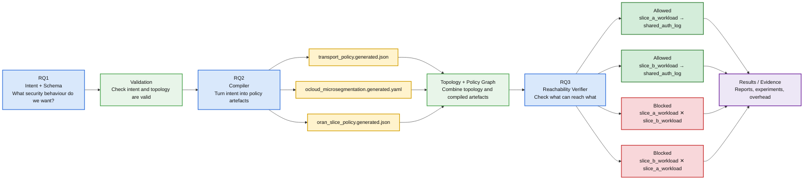
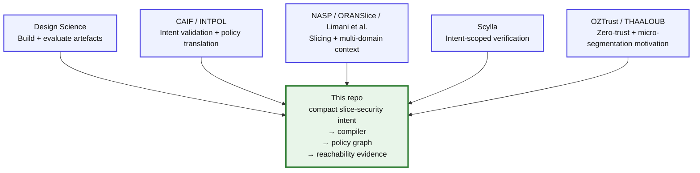

# RQ-to-Repo Mapping and Related-Work Alignment

This document explains how the GitHub repository maps to the thesis research questions, methodology, and related-work patterns.

The repository is not a separate coding exercise. It is the practical proof-of-concept implementation of the thesis pipeline.

## Main research question

The main question behind this repository is:

> How can a compact, transport-aware slice-security intent be represented, compiled into coordinated policy artefacts, and statically verified to show that forbidden cross-slice reachability is absent while required shared-service reachability remains available?

In simpler terms:

> Can we write a small security intent, turn it into policy files, and then check whether the resulting model blocks the paths that should be blocked while keeping the one required shared service reachable?

## What this repository is trying to show

The repository demonstrates one bounded assurance workflow:

```text
slice-security intent
→ validation
→ policy compilation
→ graph construction
→ reachability verification
→ evidence reports
```

The focus is deliberately narrow:

- two slices: `slice_a` and `slice_b`
- one shared service: `shared_auth_log`
- three generated policy artefacts
- one static graph-based reachability verifier
- one bounded assurance property: forbidden cross-slice paths should be absent while required shared-service paths remain available

The repository does **not** claim to implement a full production O-RAN deployment or a complete O-RAN/3GPP slice lifecycle.

## Methodology pipeline



## RQ1: compact machine-readable slice-security intent schema

### Plain-English meaning

RQ1 asks whether the required security behaviour can be written in a compact form that a machine can validate.

The intent describes:

- which slices exist
- which shared service is allowed
- which cross-slice paths are forbidden
- whether default deny is enforced
- which minimum transport and O-Cloud controls are required

### Main repo files

- `schemas/slice_security_intent.schema.json`
- `intents/two_slice_shared_auth_log.valid.yaml`
- `intents/invalid/*.yaml`
- `src/oran_slice_security/validation.py`
- `topology/base_topology.yaml`

### Demonstrated by

```bash
make validate
```

or:

```bash
python -m oran_slice_security validate-intent \
  --schema schemas/slice_security_intent.schema.json \
  --intent intents/two_slice_shared_auth_log.valid.yaml

python -m oran_slice_security validate-topology \
  --topology topology/base_topology.yaml
```

### Evidence

- the valid intent is accepted
- invalid intents are rejected
- schema and semantic validation tests pass
- E1 reports schema expressiveness results

Relevant outputs include:

- `results/reports/experiment_summary.json`
- `results/reports/experiment_summary.md`

### What RQ1 proves

RQ1 shows that the bounded slice-security scenario can be represented in a compact, machine-readable form.

### What RQ1 does not prove

RQ1 does not prove that this schema is a full industry O-RAN slice descriptor, a complete 3GPP slice lifecycle model, or a general slice-security language for every possible deployment.

## RQ2: compiler generating coordinated policy artefacts

### Plain-English meaning

RQ2 asks whether one validated intent can be translated into three coordinated policy representations.

The compiler produces exactly three policy artefacts:

- transport segmentation policy
- O-Cloud micro-segmentation policy
- minimal slice-scoped O-RAN policy representation

These are representational and graph-consumable artefacts, not production deployment files.

### Main repo files

- `src/oran_slice_security/compiler.py`
- `src/oran_slice_security/policy_models.py`
- `policies/generated/transport_policy.generated.json`
- `policies/generated/ocloud_microsegmentation.generated.yaml`
- `policies/generated/oran_slice_policy.generated.json`
- `policies/generated/manifest.json`

### Demonstrated by

```bash
make compile
```

or:

```bash
python -m oran_slice_security compile \
  --schema schemas/slice_security_intent.schema.json \
  --intent intents/two_slice_shared_auth_log.valid.yaml \
  --topology topology/base_topology.yaml \
  --out policies/generated
```

### Evidence

RQ2 is shown by:

- exactly three generated policy artefacts
- consistent slice identifiers
- consistent S-NSSAI-style values
- consistent shared-service references
- consistent transport-segment references
- consistent O-Cloud labels
- deterministic output hashes
- conflict rejection

Relevant outputs include:

- `policies/generated/transport_policy.generated.json`
- `policies/generated/ocloud_microsegmentation.generated.yaml`
- `policies/generated/oran_slice_policy.generated.json`
- `policies/generated/manifest.json`
- `results/reports/experiment_summary.json`
- `results/reports/experiment_summary.md`

### What RQ2 proves

RQ2 shows that the same validated slice-security intent can be compiled into three coordinated representational policy artefacts.

### What RQ2 does not prove

RQ2 does not prove that the generated artefacts are production-ready Kubernetes policies, live RIC policies, xApp/rApp policies, carrier transport-controller rules, or complete O-RAN deployment artefacts.

## RQ3: static graph-based reachability verification

### Plain-English meaning

RQ3 asks whether the compiled policy-and-topology model actually produces the expected reachability result.

The verifier checks whether:

- both slices can reach the approved shared service
- the two slice workloads cannot reach each other
- the transport slice segments cannot directly reach each other
- `shared_auth_log` cannot act as a bridge between slices

### Main repo files

- `src/oran_slice_security/graph_builder.py`
- `src/oran_slice_security/verifier.py`
- `src/oran_slice_security/report.py`
- `verifier/queries/baseline_queries.yaml`
- `topology/negative_controls/*.yaml`
- `results/reports/verification_report.json`
- `results/reports/verification_report.md`

### Demonstrated by

```bash
make verify
```

or:

```bash
python -m oran_slice_security verify \
  --topology topology/base_topology.yaml \
  --policies policies/generated \
  --queries verifier/queries/baseline_queries.yaml \
  --out results/reports
```

The full evidence set can be generated with:

```bash
make run-all
```

or:

```bash
python experiments/run_all_experiments.py
```

### Evidence

RQ3 is shown by:

- `slice_a_workload` can reach `shared_auth_log`
- `slice_b_workload` can reach `shared_auth_log`
- `slice_a_workload` cannot reach `slice_b_workload`
- `slice_b_workload` cannot reach `slice_a_workload`
- `tn_segment_slice_a` cannot reach `tn_segment_slice_b`
- `tn_segment_slice_b` cannot reach `tn_segment_slice_a`
- `shared_auth_log` has no outgoing transit path
- negative-control misconfigurations are rejected
- overhead metrics are reported

Relevant outputs include:

- `results/reports/verification_report.json`
- `results/reports/verification_report.md`
- `results/reports/experiment_summary.json`
- `results/reports/experiment_summary.md`
- `results/metrics/overhead_metrics.json`

### What RQ3 proves

RQ3 shows that, in the bounded local policy-and-topology model, the compiled artefacts preserve required shared-service reachability and remove forbidden cross-slice reachability.

### What RQ3 does not prove

RQ3 does not prove runtime packet delivery, production scalability, runtime drift detection, cryptographic enforcement, xApp trustworthiness, full O-RAN security, or correctness for arbitrary large networks.

## Why the slice model is abstracted

The slice model is deliberately simplified because the thesis tests one bounded assurance workflow, not a full industry slice implementation.

In real deployments, slice definitions may be spread across many layers and artefacts, including:

- RAN configuration
- transport configuration
- core-network configuration
- O-Cloud configuration
- orchestration descriptors
- policy files
- runtime monitoring systems

This repository does not try to reproduce all of those layers.

Instead, it uses a compact model that is sufficient to test the thesis claim:

> Can a slice-security intent be represented, compiled, and statically checked for forbidden cross-slice reachability?

This abstraction keeps the work feasible, reproducible, and aligned with the research questions.

## Why graph verification matters

The intent says what should happen.

The compiler generates policy artefacts that are supposed to implement that intent.

The topology describes the modelled environment.

The graph verifier checks the combined result.

This matters because mistakes can happen between the original intent and the compiled model. For example:

- the intent may be valid but the compiler may generate inconsistent artefacts
- the transport policy may allow something the workload policy denies
- the topology may contain an unsafe direct cross-slice edge
- the shared service may accidentally become a transit bridge
- policy and topology may disagree about what is reachable

The graph step is therefore an assurance check over the post-compilation model, not just a restatement of the original intent.

## Methodology and related-work alignment

The repository follows a research style used in several related works, while keeping the actual contribution narrower and more bounded.

The common pattern is:

- build a proof-of-concept artefact,
- validate or constrain intent before execution,
- translate intent into policy or deployment artefacts,
- evaluate the result in a controlled model, testbed, or prototype,
- report bounded evidence rather than claiming production-wide assurance.

### Related-work alignment chart



### Comparison table

| Related work | Similar methodology/result style | What it proves or evaluates | How my repo uses the idea | Why my contribution remains distinct |
| --- | --- | --- | --- | --- |
| Hevner et al. and Peffers et al. | Design-science problem framing, artefact construction, demonstration, evaluation, and communication | Shows how artefact-centred research can be structured and evaluated | Frames this repo as schema + compiler + verifier artefacts with evaluation evidence | My repo applies design science to one bounded O-RAN-aligned slice-security assurance problem |
| CAIF | Validates O-RAN slicing intent before actuation through a contract-like guardrail | Evaluates safer intent handling for O-RAN slicing workflows | Supports the need to validate intent before policy generation or actuation | CAIF focuses on agentic/LLM slicing or SLA intent, while this repo focuses on slice-security intent and static reachability verification |
| NASP | Translates higher-level slice requests into coordinated multi-domain deployment artefacts | Evaluates network-slice-as-a-service orchestration across domains | Supports the idea that slice requests must become coordinated multi-domain outputs | NASP is orchestration/deployment focused, while this repo is security-assurance focused |
| INTPOL | Translates security intent into controller-level policy and checks conflicts or invariants | Evaluates intent-driven security policy management in SDN-style systems | Supports the intent → policy → verification pattern | INTPOL is generic SDN/security-policy work, while this repo is O-RAN-aligned slice-security with transport/O-Cloud/O-RAN representational artefacts |
| Scylla | Verifies network intents using intent-specific slices rather than one monolithic model | Evaluates scalable data-plane verification for large networks | Supports scoping verification to the relevant property rather than proving everything | Scylla is a large-scale data-plane verifier, while this repo is a bounded local verifier for cross-slice reachability |
| ORANSlice | Demonstrates practical O-RAN slicing on open-source testbeds | Evaluates programmable O-RAN slicing capabilities | Supports O-RAN slicing as a realistic implementation context | ORANSlice is a slicing platform, while this repo abstracts the slice model to verify one security property |
| Limani et al. | Demonstrates slice isolation across RAN, transport, and core domains | Evaluates practical isolation in a 5G slicing proof of concept | Supports the importance of cross-domain isolation | Their work engineers isolation in a deployment, while this repo compiles security intent and verifies reachability in a small model |
| OZTrust / THAALOUB | Uses zero-trust, access control, and micro-segmentation ideas for O-RAN or cloud-native 5G security | Evaluates least-privilege enforcement, access control, or micro-segmentation | Motivates the repo's default-deny, allowed-path, and blocked-path logic | This repo is not a zero-trust enforcement platform; it is a slice-level assurance pipeline |

## Evidence style

The repository produces evidence in a similar proof-of-concept research style to the works above.

The evidence includes:

- validation results,
- generated artefacts,
- deterministic compiler outputs,
- graph verification reports,
- negative-control rejection,
- overhead metrics.

This evidence is intentionally local and bounded. It is meant to support the thesis claim, not to prove production O-RAN security.

## What the repo proves

Within the bounded local model, the repository demonstrates that:

- a compact slice-security intent can be validated
- invalid or unsafe bounded cases can be rejected
- a deterministic compiler can emit exactly three coordinated policy artefacts
- those artefacts can be combined with topology into a reachability graph
- required paths to `shared_auth_log` are preserved
- forbidden cross-slice paths are absent
- negative-control misconfigurations are detected
- modest local proof-of-concept overhead can be reported

## What the repo does not prove

The repository does not claim:

- complete O-RAN security
- production-grade network slicing
- full 3GPP or O-RAN slice lifecycle modelling
- live RIC, xApp, or rApp enforcement
- Kubernetes or container-platform enforcement
- cryptographic protection
- runtime packet delivery guarantees
- runtime drift detection
- fronthaul confidentiality
- xApp trustworthiness
- operator-grade deployment readiness
- production scalability

The claim is intentionally narrower:

> This repository demonstrates a bounded, model-based, static assurance workflow for one cross-slice non-reachability property in a small O-RAN-aligned proof of concept.

## Quick command summary

Install and run the full workflow:

```bash
make install
make run-all
```

Run individual stages:

```bash
make validate
make compile
make verify
make test
make experiments
```

Inspect evidence:

```bash
cat results/reports/verification_report.md
cat results/reports/experiment_summary.md
cat results/metrics/overhead_metrics.json
```

## One-line summary

RQ1 defines the security intent, RQ2 compiles it into three coordinated policy artefacts, and RQ3 checks the compiled policy-and-topology model for required and forbidden reachability.

Similar works cover parts of the pipeline, but this thesis integrates compact slice-security intent, coordinated policy compilation, and static cross-slice reachability verification in one small O-RAN-aligned proof of concept.

