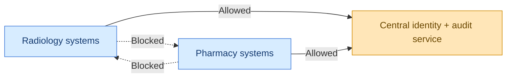

# Hospital Example: Radiology, Pharmacy, and One Approved Shared Service

## Start here

This guide is a **conceptual hospital story layered on top of the current bounded thesis implementation**.

It does **not** turn the repository into a live hospital security product.
It does **not** claim complete hospital network security.
It does **not** change the underlying bounded implementation.

The code still uses the fixed internal names `slice_a`, `slice_b`, and `shared_auth_log`. This guide simply gives those names a beginner-friendly hospital meaning.

## ELI5 version

Imagine a hospital with two groups of systems:

- Radiology systems
- Pharmacy systems

Both groups need to use one approved central service for identity and audit logging.
But they should **not** directly talk to each other whenever they feel like it.

So the repository asks a tiny, careful question:

> "In this small local model, can both departments reach the approved shared service, while still being blocked from directly reaching each other?"

That is what this repository checks.

## Story version

Think of it like this:

- Radiology has its own systems and network path.
- Pharmacy has its own systems and network path.
- The hospital has one approved central identity-and-audit service.
- Radiology is allowed to reach that central service.
- Pharmacy is allowed to reach that central service.
- Radiology should not directly reach Pharmacy.
- Pharmacy should not directly reach Radiology.
- The central shared service should act like a terminal destination, not a bridge that forwards traffic between departments.

That is the whole story.

## Friendly picture: the workflow

```mermaid
flowchart LR
    Intent["1. Intent<br/>Write the safety rules"]:::intent
    Validate["2. Validation<br/>Check the rules make sense"]:::check
    Compile["3. Compiler<br/>Turn rules into 3 policy files"]:::build
    Policies["4. Policies<br/>Transport + O-Cloud + O-RAN metadata"]:::files
    PathGraph["5. Graph<br/>Build a small map of surviving paths"]:::graphStep
    Verify["6. Verifier<br/>Check allowed and blocked paths"]:::check
    Results["7. Results<br/>Reports + E1-E5 evidence"]:::result

    Intent --> Validate --> Compile --> Policies --> PathGraph --> Verify --> Results

    classDef intent fill:#fff4b8,stroke:#d4a000,color:#5c4500;
    classDef check fill:#cfe8ff,stroke:#3c78d8,color:#123a73;
    classDef build fill:#ffd6cc,stroke:#d96c4f,color:#6b2617;
    classDef files fill:#d8f5d0,stroke:#4d9b57,color:#1f5b2a;
    classDef graphStep fill:#e7d9ff,stroke:#7a57c2,color:#40206e;
    classDef result fill:#ffe2f1,stroke:#cc4c8a,color:#7a1c4d;
```

## Friendly picture: the hospital story

## Real repo mapping

| In the code | In this hospital story | Where to look |
| --- | --- | --- |
| `slice_a` | Radiology environment | [`intents/two_slice_shared_auth_log.valid.yaml`](../../intents/two_slice_shared_auth_log.valid.yaml) |
| `slice_b` | Pharmacy environment | [`intents/two_slice_shared_auth_log.valid.yaml`](../../intents/two_slice_shared_auth_log.valid.yaml) |
| `slice_a_workload` | A representative Radiology application/system | [`intents/two_slice_shared_auth_log.valid.yaml`](../../intents/two_slice_shared_auth_log.valid.yaml), [`topology/base_topology.yaml`](../../topology/base_topology.yaml) |
| `slice_b_workload` | A representative Pharmacy application/system | [`intents/two_slice_shared_auth_log.valid.yaml`](../../intents/two_slice_shared_auth_log.valid.yaml), [`topology/base_topology.yaml`](../../topology/base_topology.yaml) |
| `shared_auth_log` | Central identity + audit logging service | [`intents/two_slice_shared_auth_log.valid.yaml`](../../intents/two_slice_shared_auth_log.valid.yaml), [`topology/base_topology.yaml`](../../topology/base_topology.yaml) |
| `tn_segment_slice_a` | Radiology-side transport path | [`topology/base_topology.yaml`](../../topology/base_topology.yaml), [`policies/generated/transport_policy.generated.json`](../../policies/generated/transport_policy.generated.json) |
| `tn_segment_slice_b` | Pharmacy-side transport path | [`topology/base_topology.yaml`](../../topology/base_topology.yaml), [`policies/generated/transport_policy.generated.json`](../../policies/generated/transport_policy.generated.json) |
| `tn_segment_shared` | Shared transport path into the central service | [`topology/base_topology.yaml`](../../topology/base_topology.yaml), [`policies/generated/transport_policy.generated.json`](../../policies/generated/transport_policy.generated.json) |
| O-Cloud micro-segmentation policy | "Which hospital workloads may talk" view | [`policies/generated/ocloud_microsegmentation.generated.yaml`](../../policies/generated/ocloud_microsegmentation.generated.yaml) |
| O-RAN slice policy metadata | Minimal per-slice metadata view | [`policies/generated/oran_slice_policy.generated.json`](../../policies/generated/oran_slice_policy.generated.json) |

## What happens at each step?

| Step | ELI5 explanation | Files involved | Why it matters |
| --- | --- | --- | --- |
| Intent | You write down the main rules: who exists, who may talk, who must stay separate. | [`intents/two_slice_shared_auth_log.valid.yaml`](../../intents/two_slice_shared_auth_log.valid.yaml) | This is the source of truth for the bounded scenario. |
| Validation | The repository checks that the intent follows the fixed rules of the model. | [`schemas/slice_security_intent.schema.json`](../../schemas/slice_security_intent.schema.json), [`src/oran_slice_security/validation.py`](../../src/oran_slice_security/validation.py) | It stops malformed or contradictory inputs early. |
| Topology | The repository reads the local map of workloads, transport segments, shared service, and policy nodes. | [`topology/base_topology.yaml`](../../topology/base_topology.yaml) | This is the physical-ish layout used for static reasoning. |
| Compiler | The repository turns the intent into exactly three small policy artefacts. | [`src/oran_slice_security/compiler.py`](../../src/oran_slice_security/compiler.py), [`policies/generated/`](../../policies/generated/) | It bridges the high-level rules and the later graph checks. |
| Generated policies | You get transport rules, O-Cloud workload rules, and minimal O-RAN slice metadata. | [`policies/generated/transport_policy.generated.json`](../../policies/generated/transport_policy.generated.json), [`policies/generated/ocloud_microsegmentation.generated.yaml`](../../policies/generated/ocloud_microsegmentation.generated.yaml), [`policies/generated/oran_slice_policy.generated.json`](../../policies/generated/oran_slice_policy.generated.json) | These are the machine-readable outputs that the verifier reasons over. |
| Graph builder | The repository keeps only the paths that survive both the topology and the compiled policies. | [`src/oran_slice_security/graph_builder.py`](../../src/oran_slice_security/graph_builder.py) | This turns the policy question into a clean path question. |
| Verifier | The repository checks required paths, forbidden paths, and the "shared service must stay terminal" rule. | [`src/oran_slice_security/verifier.py`](../../src/oran_slice_security/verifier.py), [`verifier/queries/baseline_queries.yaml`](../../verifier/queries/baseline_queries.yaml) | This is the core bounded static assurance step. |
| Experiments | The repository packages validation, compilation, verification, negative controls, and overhead checks into E1-E5. | [`experiments/`](../../experiments/) | This creates the thesis evidence pack. |
| Results | The repository writes human-readable and machine-readable reports. | [`results/reports/`](../../results/reports/), [`results/metrics/`](../../results/metrics/) | This is what you inspect, cite, and reproduce. |

## How it works, step by step

### 1. Intent

The intent says:

- there are exactly two slices,
- both can reach one approved shared service,
- both are blocked from directly reaching the other slice,
- default deny is required,
- transport isolation is required,
- the shared service must be terminal.

In hospital language, that means Radiology and Pharmacy both get access to the central identity-and-audit service, but they are not allowed to behave like one flat, open network.

### 2. Validation

Validation checks that the input is not missing key parts and is not contradicting itself.

Example questions validation answers:

- "Did you accidentally define the wrong number of slices?"
- "Did you forget the shared service?"
- "Did you write an ambiguous direction?"
- "Did you allow the shared service to become a transit node?"

### 3. Topology

The topology is the bounded map of the world.

It says:

- which workload belongs to which slice,
- which transport segment each workload uses,
- how the shared transport segment connects to the approved shared service,
- that default deny is turned on.

### 4. Compiler

The compiler takes the high-level intent and emits three representational policy files.

You can think of them like three little views of the same hospital story:

- transport view,
- workload micro-segmentation view,
- per-slice metadata view.

### 5. Generated policy artefacts

The generated artefacts are **not** production firewall rules and **not** live hospital enforcement.

They are small, deterministic artefacts used so the repository can reason about the bounded model consistently.

### 6. Graph builder

The graph builder asks:

> "If I combine the topology with the compiled policies, which edges survive?"

That produces a small directed graph.
In the current successful baseline, the surviving graph has eight nodes and five edges.

### 7. Verifier

The verifier then asks three simple questions:

1. Can Radiology reach the central service?
2. Can Pharmacy reach the central service?
3. Are the forbidden cross-department and cross-transport paths still blocked?

It also checks that the shared service is terminal and not acting like a forwarding hop.

### 8. Experiments and results

The experiments package everything into bounded evidence:

- E1 checks schema expressiveness.
- E2 checks compiler coherence.
- E3 checks reachability and non-reachability.
- E4 checks negative controls.
- E5 records modest local overhead metrics.

You can see the current human-readable outputs in:

- [`results/reports/verification_report.md`](../../results/reports/verification_report.md)
- [`results/reports/experiment_summary.md`](../../results/reports/experiment_summary.md)

## Why each part matters

| Part | Why it matters in the hospital story |
| --- | --- |
| Intent | Lets you say the safety rule once at a high level. |
| Validation | Prevents silly or dangerous inconsistencies from slipping through. |
| Topology | Gives the verifier a concrete bounded map to reason about. |
| Compiler | Keeps the process deterministic and repeatable. |
| Policy artefacts | Makes the rules inspectable and graph-consumable. |
| Graph builder | Converts policy logic into a path-checking problem. |
| Verifier | Answers the key bounded safety question directly. |
| Experiments | Turns the workflow into reproducible thesis evidence. |
| Results | Gives a supervisor or reader something concrete to inspect. |

## How can I customize this?

### Safe to tweak

These are low-risk, documentation-friendly changes:

- Change the story mapping. Radiology and Pharmacy could instead be Labs and Billing, or two other departments.
- Add more beginner-friendly explanation, diagrams, or walkthroughs.
- Add more domain examples that keep the same underlying `slice_a`, `slice_b`, and `shared_auth_log` model.
- Add more descriptive notes around the current reports and experiments.

### Medium-risk tweaks

These stay closer to the current bounded model, but they affect reproducible artefacts or tests:

- Add another negative-control case that still fits the two-slice, one-shared-service structure.
- Add another example intent or topology document that preserves the same bounded pattern.
- Adjust metadata values like namespace labels while keeping the fixed two-slice shape intact.

### Changes that would break the current bounded thesis scope

These move beyond what the current repository claims:

- adding a third slice,
- adding multiple shared services,
- turning the representational artefacts into claims about production enforcement,
- claiming live hospital deployment or runtime packet inspection,
- claiming complete hospital zero-trust implementation,
- claiming more than local static model-based assurance.

## What's next?

If you want sensible next steps without weakening the thesis safety boundary, good options are:

1. Add another negative-control example and explain what it teaches.
2. Add another story mapping, such as finance, manufacturing, or campus networks.
3. Add a one-page "follow the files" tutorial for first-time readers.
4. Add more diagrams that explain the fixed bounded model visually.
5. Compare multiple domain stories while keeping the same underlying implementation.
6. Keep future-work ideas clearly separate from the current thesis claim.

## Final note

This hospital guide is a teaching layer, not a scope expansion.

The current repository still proves only a **bounded, local, static, model-based** property:

- two fixed slices,
- one fixed shared terminal service,
- compiled representational artefacts,
- graph-based reachability and non-reachability checks,
- reproducible local evidence.

That narrowness is a strength here, because it keeps the claim honest.
